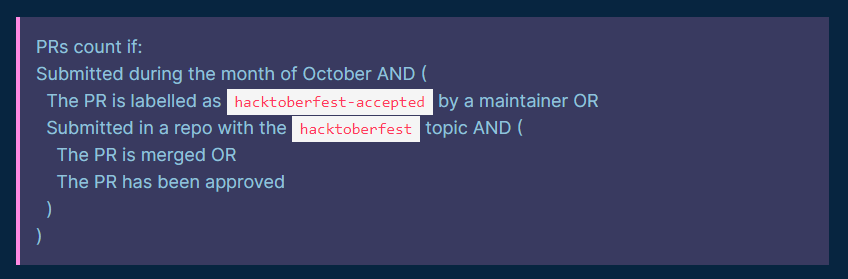

# HACKTOBERFEST 2020

### Hacktoberfest is a month-long virtual festival to celebrate open source software in partnership with Github. It is celebrated in the month of October every year. All you have to do is contribute to any open source projects and make at least 4 pull requests within the month of October.

### The first 70,000 participants who successfully complete the challenge will be eligible to receive a prize. (Do it soon, let's start! ;) )

### This is a beginner-friendly repo to help you in open-source contributions. Made specifically for HACKTOBERFEST 2020!

### Please check first if your code is already present in this repo, if it's already there then don't add that!

### How to create pull requests (PRs)?
  1. Sign up or sign in to your <a href="https://github.com/"> Github </a> account.
  2. Register yourself at <a href="https://hacktoberfest.digitalocean.com/"> Hactoberfest 2020 </a> using your Github account.
  3. Come back to this <a href="https://github.com/Cullyege/Hacktoberfest2020"> Hacktoberfest repo</a>.
  4. Click on Fork.
  4. Open folder of your choice. (If it is not listed, feel free to add one, or simply go to others).
  5. Add your algorithm/code or simply follow the steps mentioned there.
  

` You need to make 4 pull requests to win an exclusive Hacktoberfest 2020 Tshirt and stickers! `

~~Even if your pull requests aren’t accepted, it should count towards your 4 pull requests (that's necessary to win the swags).~~

**UPDATED (10/05/2020 15:00 UTC):** 

**[An update on efforts to reduce spam with Hacktoberfest](https://hacktoberfest.digitalocean.com/hacktoberfest-update)**

We will honor all valid pull requests prior to this change, and as of October 3, 2020 at 12:00:00 UTC – and October 3 in all time zones – pull requests will only count toward earning a T-shirt or planting a tree if they are labeled as ‘hacktoberfest-accepted’ by a maintainer, or submitted in a repository classified with the ‘hacktoberfest’ topic. Pull requests in repositories with the ‘hacktoberfest’ topic will also need to be merged, approved by a maintainer, or labeled as ‘hacktoberfest-accepted’ in order to qualify. The deadline for completions, merging, labeling, and approving is November 1.

To put the rules in a form consistent with the spirit of Hacktoberfest:

### Give it a Star if you liked it! ⭐

### For any query feel free to reach out to us at hellocullyege@gmail.com
